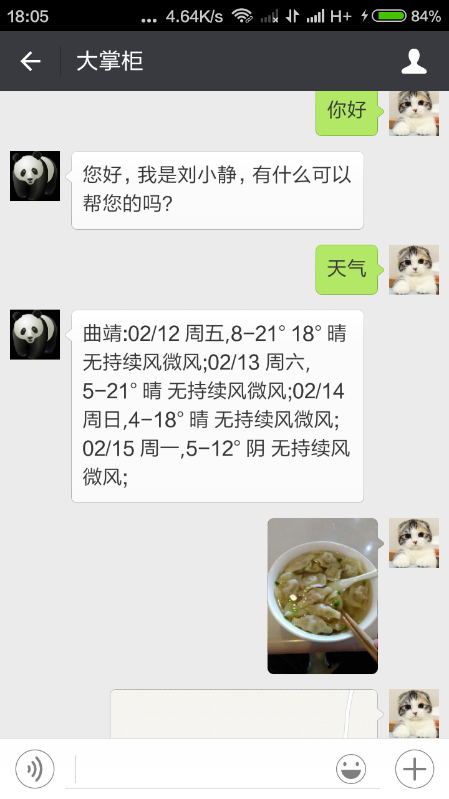
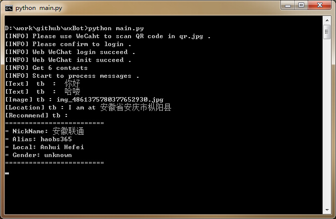
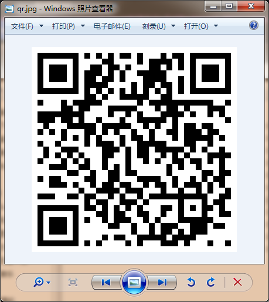

# wxBot [](http://github.com/liuwons/wxBot) [](http://github.com/liuwons/wxBot/fork) 

Python包装的网页微信API。可以很容易地实现微信机器人。

## Dependencies
程序用到了Python requests 和 pyqrcode库，使用之前需要安装这两个库:

```bash
pip install requests
pip install pyqrcode
```

## Demo
配置了 **[图灵机器人](http://www.tuling123.com/)** 之后，通过测试账号发送各种消息的效果：




## Run
### 运行程序

``` bash
python wxbot.py
```

### 登录微信

程序运行之后，会在当前目录下生成二维码图片文件 qr.jpg ，用微信扫描此二维码并按操作指示确认登录网页微信。可以选择是否自动回复。




按照操作指示在手机微信上扫描二维码然后登录，你可以选择是否开启自动回复模式。
