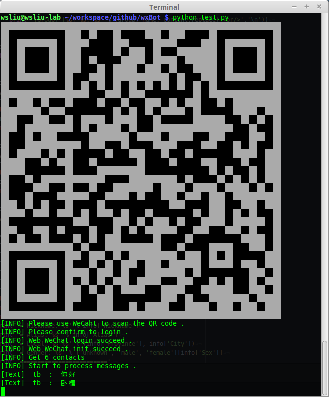

# wxBot [](http://github.com/liuwons/wxBot) [](http://github.com/liuwons/wxBot/fork) 

Python包装Web微信实现的微信机器人框架。可以很容易地实现微信机器人。

## 环境与依赖

目前只能运行于Python 2环境 。
**wxBot** 用到了Python **requests** , **pypng** , 以及 **pyqrcode** 库，使用之前需要安装这三个库:

```bash
pip install requests
pip install pyqrcode
pip install pypng
```

## 快速开发
### 代码

利用 **wxBot** 最简单的方法就是继承WXBot类并实现handle_msg_all或者schedule函数，然后实例化子类并run，如下的代码对所有来自好友的文本消息回复 "hi"， 并不断向好友tb发送"schedule"。
handle_msg_all函数用于处理收到的每条消息，而schedule函数可以做一些任务性的事情(例如不断向好友推送信息或者一些定时任务)。

```python
#!/usr/bin/env python
# coding: utf-8

import time
from wxbot import *

class MyWXBot(WXBot):
    def handle_msg_all(self, msg):
        if msg['msg_type_id'] == 4 and msg['content']['type'] == 0:
            self.send_msg_by_uid('hi', msg['user']['id'])

    def schedule(self):
        self.send_msg('tb', 'schedule')
        time.sleep(1)

def main():
    bot = MyWXBot()
    bot.DEBUG = True
    bot.run()

if __name__ == '__main__':
    main()

```

### 运行

直接用python运行代码(如运行测试代码test.py):

``` python
python test.py
```

### 登录微信

程序运行之后，会在当前目录下生成二维码图片文件 qr.png ，用微信扫描此二维码并按操作指示确认登录网页微信。


如果运行在Linux下，还可以通过设置WXBot对象的conf['qr']为'tty'的方式直接在终端打印二维码(此方法只能在Linux终端下使用)，效果如下：



## 效果展示

测试代码test.py的运行效果：


## 接口
### handle_msg_all

handle_msg_all函数的参数msg是代表一条消息的字典。字段的内容为：

| 字段名 | 字段内容 |
| ----- | --- |
| msg_type_id | 整数，消息类型，具体解释可以查看消息类型表 |
| msg_id | 字符串，消息id |
| content | 字典，消息内容，具体含有的字段请参考消息类型表，一般含有type(数据类型)与data(数据内容)字段，type与data的对应关系可以参考数据类型表 |
| user | 字典，消息来源，字典包含name(发送者名称)字段与id(发送者id)字段，都是字符串  |


消息类型表：

| 类型号 | 消息类型 | content |
| ----- | --- | ------ |
| 0 | 初始化消息，内部数据 | 无意义，可以忽略 |
| 1 | 自己发送的消息 | 无意义，可以忽略 |
| 2 | 文件消息 | 字典，包含type与data字段 |
| 3 | 群消息 | 字典， 包含user(字典，包含id与name字段，都是字符串，表示发送此消息的群用户)与type、data字段 |
| 4 | 联系人消息 | 字典，包含type与data字段 |
| 5 | 公众号消息 | 字典，包含type与data字段 |
| 6 | 特殊账号消息 | 字典，包含type与data字段 |
| 99 | 未知账号消息 | 无意义，可以忽略 |


数据类型表：

| type | 数据类型 | data |
| ---- | ---- | ------ |
| 0 | 文本 | 字符串，表示文本消息的具体内容 |
| 1 | 地理位置 | 字符串，表示地理位置 |
| 3 | 图片 | 字符串，图片数据的url，HTTP POST得到jpg文件格式的数据 |
| 4 | 语音 | 字符串，语音数据的url，HTTP POST得到mp3文件格式的数据 |
| 5 | 名片 | 字典，包含nickname(昵称)，alias(别名)，province(省份)，city(城市)， gender(性别)字段 |
| 6 | 动画 | 字符串， 动画url |
| 7 | 分享 | 字典，包含type(类型)，title(标题)，desc(描述)，url(链接)，from(来自)字段 |
| 8 | 视频 | 字符串，未解析的xml字符串 |
| 9 | 视频电话 | 字符串，未解析的xml字符串 |
| 10 | 撤回消息 | 字符串，未解析的xml字符串 |
| 11 | 空内容 | 空字符串 |
| 12 | 未知类型 | 字符串，未解析的xml字符串 |


### WXBot对象属性

WXBot对象在登录并初始化之后,含有以下的可用数据:

| 属性 | 描述 |
| ---- | ---- |
| contact_list | 当前用户的微信联系人列表 |
| group_list | 当前用户的微信群列表 |
| public_list | 当前用户关注的公众号列表 |
| special_list | 特殊账号列表 |
| session | WXBot与WEB微信服务器端交互所用的requests Session对象 |

WXBot对象还含有一些可以利用的方法：

| 方法 | 描述 |
| ---- | --- |
| get_icon(id) | 获取用户icon并保存到本地文件 img_[id].jpg ,id为用户id(Web微信数据) |
| get_head_img(id) | 获取用户头像并保存到本地文件 img_[id].jpg，id为用户id(Web微信数据) |
| get_msg_img(msgid) | 获取图像消息并保存到本地文件 img_[msgid].jpg, msgid为消息id(Web微信数据) |
| get_voice(msgid) | 获取语音消息并保存到本地文件 voice_[msgid].mp3, msgid为消息id(Web微信数据) |
| get_user_remark_name(uid) | 获取好友的备注名，没有备注名则获取好友微信号， uid为好友的用户id(Web微信数据) |
| send_msg_by_uid(word, dst) | 向好友发送消息，word为消息字符串，dst为好友用户id(Web微信数据) |
| send_msg(name, word, isfile) | 向好友发送消息，name为好友的备注名或者好友微信号，isfile为False时word为消息，isfile为True时word为文件路径(此时向好友发送文件里的每一行) |
| is_contact(uid) | 判断id为uid的账号是否是本帐号的好友，返回True(是)或False(不是) |
| is_public(uid) | 判断id为uid的账号是否是本帐号所关注的公众号，返回True(是)或False(不是) |
